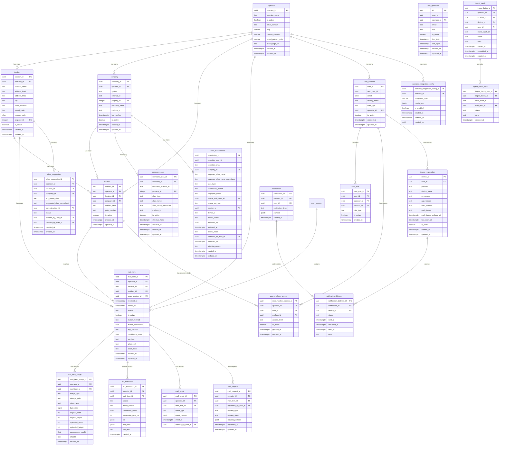

# C3Scan Database Schema ERD

Generated from Supabase `c3scan` database schema.

## Legend

- **Tables** (solid rectangles) - Writable entities
- **Views** (dashed rectangles) - Read-only, do not write directly
- **PK** - Primary Key
- **FK** - Foreign Key
- **V** - View (read-only)

---

## Core Entity Relationship Diagram

---

## Views (Read-Only)

**Do not write directly to these views.** They are computed from base tables.

| View Name | Purpose | Base Tables |
|-----------|---------|-------------|
| `operator_v` | Operator summary | `operator` |
| `location_v` | Location with resolved fields | `location`, `operator` |
| `company_v` | Company with resolved fields | `company`, `operator` |
| `company_alias_resolved_v` | Aliases with company names | `company_alias`, `company` |
| `company_alias_resolved_v` | Aliases with full resolution | `company_alias`, `company`, `location` |
| `v_member_mailbox_access` | Member access to mailboxes | `user_mailbox_access`, `mailbox`, `company` |
| `v_mail_item_inbox` | Mail items for inbox display | `mail_item`, `mail_request` |
| `v_admin_ocr_latest_per_mail_item` | Latest OCR per mail item | `ocr_extraction` |
| `v_admin_pending_alias_suggestions` | Pending suggestions for admin | `alias_suggestion`, `company`, `location`, `operator` |
| `v_admin_ingest_batches` | Batch ingest status | `ingest_batch`, `operator`, `location`, `device_registration` |
| `v_admin_notification_status` | Notification delivery status | `notification`, `device_registration` |
| `pending_submissions_detail` | Pending alias submissions | `alias_submissions`, `companies` |
| `staff_submission_stats` | Stats per staff member | `alias_submissions` |

---

## Table Reference

### operator
Top-level tenant entity (coworking operator).

| Column | Type | Notes |
|--------|------|-------|
| operator_id | uuid | PK, default: gen_random_uuid() |
| operator_name | text | Operator display name |
| is_active | boolean | default: true |
| email_domain | text | Used for mobile auth operator resolution |
| slug | varchar(50) | URL-friendly (e.g., "thinkspace") |
| custom_domain | varchar(255) | White-label CNAME |
| brand_primary_color | varchar(7) | Hex color (e.g., "#0066CC") |
| brand_logo_url | text | Logo URL |
| created_at | timestamptz | default: now() |
| updated_at | timestamptz | default: now() |

### location
Physical site; scopes staff activity and mail storage.

| Column | Type | Notes |
|--------|------|-------|
| location_id | uuid | PK, default: gen_random_uuid() |
| operator_id | uuid | FK → operator.operator_id |
| location_name | text | Display name |
| address_line1 | text | |
| address_line2 | text | |
| city | text | |
| state_province | text | |
| postal_code | text | |
| country_code | char(2) | ISO country code |
| property_id | integer | External system reference |
| is_active | boolean | default: true |
| created_at | timestamptz | default: now() |
| updated_at | timestamptz | default: now() |

### company
A business or entity that receives mail.

| Column | Type | Notes |
|--------|------|-------|
| company_id | uuid | PK, default: gen_random_uuid() |
| operator_id | uuid | FK → operator.operator_id |
| system | text | Source system identifier |
| external_id | text | External system ID |
| property_id | integer | FK → location.property_id |
| company_name | text | Display name |
| mailbox_id | text | Reference to primary mailbox |
| last_verified | timestamptz | Last validation timestamp |
| is_active | boolean | default: true |
| created_at | timestamptz | default: now() |
| updated_at | timestamptz | default: now() |

### mailbox
Customer mailbox (virtual office).

| Column | Type | Notes |
|--------|------|-------|
| mailbox_id | uuid | PK, default: gen_random_uuid() |
| operator_id | uuid | FK → operator.operator_id |
| location_id | uuid | FK → location.location_id |
| company_id | uuid | FK → company.company_id |
| mailbox_label | text | Display label |
| pmb_number | text | Private mailbox number |
| is_active | boolean | default: true |
| created_at | timestamptz | default: now() |
| updated_at | timestamptz | default: now() |

### company_alias
Aliases for company matching (DBA names, authorized members, OCR variants).

| Column | Type | Notes |
|--------|------|-------|
| company_alias_id | uuid | PK, default: gen_random_uuid() |
| company_id | uuid | FK → company.company_id |
| company_external_id | text | External reference |
| property_id | integer | FK → location.property_id |
| alias_type | text | Type: dba, authorized_member, ocr_variant |
| alias_name | text | Original alias name |
| alias_name_normalized | text | Normalized for matching |
| mailbox_id | text | Associated mailbox |
| is_active | boolean | default: true |
| effective_from | timestamptz | Validity start |
| effective_to | timestamptz | Validity end |
| created_at | timestamptz | default: now() |
| updated_at | timestamptz | default: now() |

### mail_item
A scanned/received piece of mail.

| Column | Type | Notes |
|--------|------|-------|
| mail_item_id | uuid | PK, default: gen_random_uuid() |
| operator_id | uuid | FK → operator.operator_id |
| location_id | uuid | FK → location.location_id |
| mailbox_id | uuid | FK → mailbox.mailbox_id |
| scan_session_id | uuid | FK → scan_session.scan_session_id |
| received_at | timestamptz | default: now() |
| stored_at | timestamptz | When physically stored |
| status | text | received, processed, etc. |
| is_active | boolean | default: true |
| match_method | text | How matched: fuzzy, manual, etc. |
| match_confidence | float | Confidence score 0-1 |
| app_version | text | Scanner app version |
| confidence_score | float | OCR confidence |
| ocr_text | text | Extracted OCR text |
| photo_url | text | Image URL (deprecated, use storage_path) |
| scan_mode | text | Scan mode used |
| created_at | timestamptz | default: now() |
| updated_at | timestamptz | default: now() |

### mail_item_image
Images associated with mail items.

| Column | Type | Notes |
|--------|------|-------|
| mail_item_image_id | uuid | PK, default: gen_random_uuid() |
| operator_id | uuid | FK → operator.operator_id |
| mail_item_id | uuid | FK → mail_item.mail_item_id |
| image_type | text | envelope, label, interior, etc. |
| storage_path | text | Supabase Storage path |
| mime_type | text | image/jpeg, image/png, etc. |
| byte_size | bigint | File size in bytes |
| original_width | int | Original image width |
| original_height | int | Original image height |
| uploaded_width | int | Uploaded/processed width |
| uploaded_height | int | Uploaded/processed height |
| compression_quality | float | Compression ratio |
| sha256 | text | File hash for deduplication |
| created_at | timestamptz | default: now() |

### ocr_extraction
OCR processing results for mail items.

| Column | Type | Notes |
|--------|------|-------|
| ocr_extraction_id | uuid | PK, default: gen_random_uuid() |
| operator_id | uuid | FK → operator.operator_id |
| mail_item_id | uuid | FK → mail_item.mail_item_id |
| source | text | ios, admin, etc. |
| model_version | text | OCR model used |
| confidence_score | float | Overall confidence |
| processing_time_ms | int | Processing duration |
| roi | jsonb | Region of interest coordinates |
| text_lines | jsonb | Array of text lines with coords |
| raw_text | text | Full extracted text |
| created_at | timestamptz | default: now() |

### alias_suggestion
Unmatched mail suggestions for admin review.

| Column | Type | Notes |
|--------|------|-------|
| alias_suggestion_id | uuid | PK, default: gen_random_uuid() |
| operator_id | uuid | FK → operator.operator_id |
| location_id | uuid | FK → location.location_id |
| company_id | uuid | FK → company.company_id (if matched) |
| suggested_alias | text | Suggested company name |
| suggested_alias_normalized | text | Normalized for matching |
| ocr_extraction_id | uuid | FK → ocr_extraction.ocr_extraction_id |
| status | text | pending, approved, rejected |
| created_by_user_id | uuid | FK → user_account.user_id |
| decided_by_user_id | uuid | FK → user_account.user_id |
| decided_at | timestamptz | When decision made |
| created_at | timestamptz | default: now() |

---

## Writeable vs Read-Only Summary

### Tables (Writable)
- `operator`
- `location`
- `company`
- `mailbox`
- `company_alias`
- `user_account`
- `user_role`
- `user_mailbox_access`
- `user_operators`
- `mail_item`
- `mail_item_image`
- `mail_request`
- `mail_event`
- `ocr_extraction`
- `alias_suggestion`
- `alias_submissions`
- `ingest_batch`
- `ingest_batch_item`
- `scan_session`
- `device_registration`
- `notification`
- `notification_delivery`
- `operator_integration_config`
- `scanned_mail` (legacy, being phased out)

### Views (Read-Only - DO NOT WRITE)
- `operator_v`
- `location_v`
- `company_v`
- `company_alias_resolved_v`
- `company_alias_resolved_v`
- `v_member_mailbox_access`
- `v_mail_item_inbox`
- `v_admin_ocr_latest_per_mail_item`
- `v_admin_pending_alias_suggestions`
- `v_admin_ingest_batches`
- `v_admin_notification_status`
- `pending_submissions_detail`
- `staff_submission_stats`

### Legacy Tables (Migrating)
- `companies` → use `company`
- `locations` → use `location`
- `company_aliases` → use `company_alias`
- `scan_sessions` → use `scan_session`
